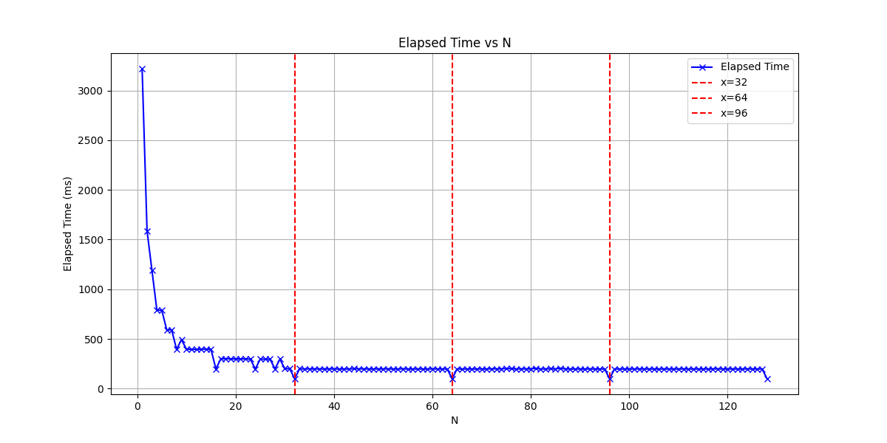

I work with GPUs at work every day, but I’ve always struggled to really understand what’s happening under the hood. Most of my work is through high-level libraries and frameworks, which abstract away all the scheduling, memory hierarchies, and execution details. I knew GPUs were fast, but I didn’t really understand why.

At university, exercises in reverse engineering CPUs really helped me understand cache hierarchies, instruction latencies, and performance quirks. I decided to try something similar on an Nvidia Jetson Orin Nano: treat the GPU as a black box and reverse engineer its microarchitecture through simple experiments.

I’m by no means an expert in GPUs, this is me poking at the Jetson Nano to see what I can learn.  

---

## Part 1: Warp Size

In this first experiment, I want to figure out the warp size: the smallest group of threads a GPU executes simultaneously.

**Idea:** Threads in a warp execute instructions in lockstep. If the control flow diverges between threads in a warp, the Streaming Multiprocessor will serialize execution until the threads converge again. Divergent code can therefore slow things down, and I’ll use this behavior to my advantage.

The kernel I designed splits threads into groups of size `N`. Threads in the same group perform the same instructions. By varying `N` and measuring execution time, we can find an `N` that minimizes the kernel runtime. That `N` is the warp size (or a multiple of it):

```cpp
__global__ void divergent_kernel(unsigned long long clock_count, unsigned long long *out, int N) {

    // Calculate which group the current thread belongs to:
    int group = threadIdx.x / N;

    for (int i = 0; i < (2<<20); i++) {

        if (group == i) { 
            unsigned long long start = clock64();
            while (clock64() - start < clock_count) {
                // spin
            }
            out[threadIdx.x] = clock64();
        }
        
    }
        
}
```
Threads execute in lockstep until they reach the if (group == i) condition. If any thread in a warp belongs to group i, all other threads in the warp must wait until it finishes, effectively serializing execution. Here, each thread spins for a predetermined number of cycles (100 million). The kernel runs fastest when all threads belong to the same group, indicating that `N` is the warp size or a multiple of it.

Timing the execution for increasing values of `N` yields the following results:



There are clear valleys at 32 and multiples of 32, indicating that 32 is the size of a warp.

There are clear valleys at 32 and its multiples, indicating that the warp size is 32 threads.

**Note**: This first part was more of a warm-up, unsurprisingly, all modern Nvidia GPUs have a warp size of 32.


## Part N+1: Work in progress
Next, I’ll explore how many blocks can be scheduled per Streaming Multiprocessor, memory latency, and cache behavior, using similar timing-based experiments. Stay tuned!